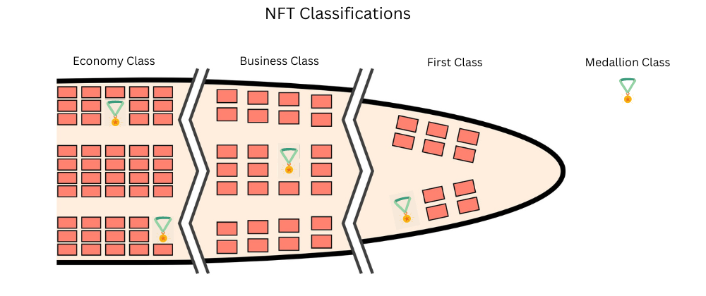

>  Disclaimer: This content is for informational purposes only. It is not a recommendation to purchase tokens or any other assets. Any investments made in the projects or assets mentioned below are done so at your own risk. This is not financial advice.

### TL;DR
- NFTs are growing in popularity and mainstream adaptation
- There will be billions of NFTs available for you to own
- Deciding the types of NFTs to own will be confusing and time-consuming
- Classifying NFTs as first class, business class, and economy class NFTs will help in deciding which NFTs to own
- NFTs are growing in popularity, and mainstream adaptation
- Medallion class NFTs earn you status based on your actions

NFTs represent arts, game items, music, domain names, books, trading cards, real estates, luxury goods, rewards, and many more. Innovation and technology around NFTs are rapidly advancing to enable more and more use cases. Intrinsic properties such as uniqueness, identity, status, and ownership of NFTs are increasing the utility, price, and value of NFTs for their owners.

There are many kinds of NFTs in different price ranges and types of usage. It's confusing and also time-consuming to decide which NFTs to own. Having a simple classification for NFTs as we have for travel tickets, such as First Class, Business Class, and Economy Class can help us to understand the utility value of NFTs, and make decisions to own them.

Here is how you can classify NFTs. 

### First Class NFTs
Price Range: 100,000 to Millions

First class NFTs are rare and expensive one-off arts, collectible profile pictures (PFP), most popular videos or photos, the first written tweet, or source code.

Here is a small list of First Class NFTs and the prices they sold
- Beeple’s digital art ‘Everydays: The First 5000 Days’ : $69.3 Million
- CryptoPunk #7523: $11.8 Million
- World Wide Web Source Code – $5.4 Million
- First Tweet: $2.9 Million
- Charlie Bit Me YouTube Video: $761,000
- Disaster Girl Meme: $500,000

Mostly first-class NFTs are bought to show off financial status. They are speculative investments that you expect no utility from them. 

### Business Class NFTs
Price Range: 1,000 to 100,000

Business class NFTs provide full IP rights to the underlying asset with other benefits like access to an elite community of those NFT holders. Business class NFTs help you build a business with the NFT that you own. You can think of buying a business class NFT as an upfront capital investment for your future business.

Here is a list of business class NFTs and their utility value.
- As an owner of Bored Ape Yacht Club (BAYC) NFT, you have complete IP of the underlying digital art. You can create a business by selling T-shirts and accessories featuring the ape you own.
- Digital Land NFTs are other examples of business class NFTs that allow you to build virtual experiences like online art gallery or rent your digital land to earn income.

### Economy Class NFTs
Price Range: 10 to 100

Economy class NFTs are more affordable and provide ownership for many things. You own your favorite movie, animation character, community membership, and many others as economy class NFTs. These NFTs are not scares, but you get some utility by owning these NFTs.

Example of economy class NFTs are:
- Warner Bros Lord Of The Rings Movie NFTs
- Superman Comic NFTs 
- Reddit community NFTs
- The Disney Pixar Pals NFT Collection
- Battle Infinity – Popular NFT Rewards Game

Economy class NFTs specifically token gated community membership NFTs are a great starting point for you to own NFTs and experience the benefits of your NFTs.

First Class, Business Class and Economy Class NFTs are all mainstream. You decide to buy any of these NFTs depending on your affordability, interest, beliefs, culture, and other aspects. 

A new class of NFTs is emerging thath are “Free-to-own” which refers to a strategy whereby the creator or brand gives away an unlimited supply of NFTs for free. I call them as medallion class NFTs. 

### Medallion Class NFTs
Price Range: Mostly Free 

Medallion class NFTs are are mostly “Free-to-own” or you pay a small gas fee for minting them. Loyalty rewards, digital coupons, video games, memberships access are few examples of medallion class NFTs. These free or low gas-priced NFTs provide entry-level access and allow you to level up your status based on your actions. Examples are

- You will receive loyalty rewards as a free NFT from a brand. Eventually as you buy more products and participate in brand promotional events, you level up your membership from silver to gold status to get more discounts and perks from the brand.
- Another example of medallion class NFTs is entry-level community membership. Your membership status in the community grows as your contribute increases to get additional benefits such as voting power or content moderation. 

Medallion class NFTs provide real utility for their holders. Other classes of NFTs intentionally limit the supply of NFTs to create scarcity, but with medallion class NFT status is the scarcity.

### Conclusion:
Classifying an NFT as First Class, Business Class, Economy Class or Medallion Class allows you decide and evalute the value of an NFT without much confusion.  

The best NFTs long-term will be the ones you earn and not the ones you buy. Medallion class NFTs that are free to own are a good starting point in owning NFTs. Medallion class NFTs allow you to evaluate the benefits of those NFTs by gradually increasing your spending or efforts to level up your status with a brand or community. The value of medallion class NFTs will increase as your status grow to provide more benefits.

