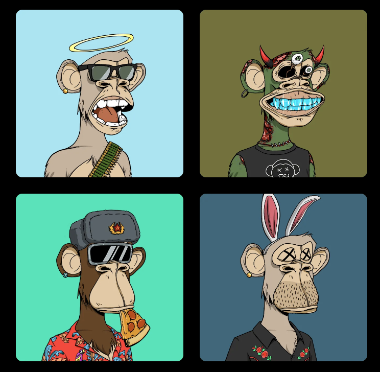

### The Hype

The buzz around Non-fungible Tokens (NFTs) is everywhere, and its hard to miss them.

- Artist Beeple sold his "Everydays: the First 5000 Days" composite art as an NFT at Christie’s for $69 million
- “The Merge” a virtual artwork is the most expensive NFT ever sold for $92 million
- Bored Apes and CryptoPunks profile picture NFT collections are worth $3.6 billion

NFTs have been around only for a few years, but they created a market with billions of dollars in transactions.

Dune NFT market analytics [dashboard](https://dune.com/hildobby/NFTs "dashboard")

>  ** NFTs are at the peak of inflated expectations, but they are here to stay.** 

Market hype and FOMO on NFTs are slowly winding down. Like when the dust settles, the vision becomes clear. Now industries such as arts, music, video games, sports, movies, luxury products, and many others have started using NFTs for growing their businesses. Consumers are realizing the utility benefits of NFTs not just the speculation. NFTs are now gaining mainstream adoption.

For many who missed the first wave of NFTs, don't worry we are just getting started. In this article we will deep dive into important aspects of NFTs and thier uses cases. 

### What are NFTs?

NFTs stand for non-fungible tokens. 

A dollar is fungible because you can trade your dollar for another dollar. Non-fungible means it is unique, one-of-a-kind, and you cannot replace one for another. Think of the Mona Lisa painting, there is only one in the world.

NFTs use blockchain technology to ensure authenticity and to prove ownership of their underlying asset. If you own a digital art as NFT, people can still take a screenshot and use it, but they cannot prove authenticity and ownership because anyone can verify in the blockchain that you are the ultimate owner of that art. Examples of NFTs are art, virtual avatars, GIFs, videos, trading cards, memes, domain names, in-game items, real estate, aged wines & whisky, and so on.

### Characteristics of NFTs

NFTs mainly derive their value based on scarcity, utility, and provenance. But below are few characteristics that make them valuable.

- **Unique:** NFTs are unique (one-of-a-kind) and can be provable and verified on a blockchain.

- **Programmable:** NFTs have programmable code called smart contracts that execute on a blockchain automatically on certain conditions. Example: Smart contract in an NFT art can automatically earn royalty for the creator every time its traded. Programmability of royalties in NFTs is most important for creators to make recurring income.

- **Composable:** NFTs belong to cryptocurrency ecosystem and anyone can own or trade an NFT for any other cryptocurrency asset. When “composed” (plugged into, combined) with decentralized finance cryptocurrency building blocks, NFT can be used as collateral in taking out a loans or being able to rent out or earn interests on the NFTs.

- **Permissionless:** You never need any permission to create or own NFTs. Many NFTs exist on a permissionless blockchain like Ethereum or Solana. These blockchains are open for anyone to join and maintained by communities for you can also contribute.

- **Permanent:** Data of NFTs such as account address, message, image, music, and signature are stored in immutable blocks of a blockchain. As such NFT data are immutable and permanent.

- **Digital Ownership:** NFT holders ultimately own and control the underlying content or asset. Videos or photos you post on social media platforms like Facebook and YouTube are controlled by those platforms. These platforms have complete ownership to your content and monetize on them. However, by holding your content as NFTs you truly own and can monetize your content.

### NFTs Use Cases

NFTs are in their early stages right now, but innovative new use cases are emerging every day. Here are a few impressive NFT projects that reveal different use cases of NFTs.

- **Axie Infinity:** Axie Infinity is an NFT-based play-to-earn online game where players collect, breed, and create creatures called Axies and pit them against each other in battles. Like Pokémon, each player uses a team of three Axies to go through an adventure mode or battle other Axie teams in the PVP( player versus player) arena. The more a person plays, the more Smooth Love Potions (or SLP) tokens they can earn. SLP can be converted into Ethereum cryptocurrency and sold for profit. Axies are NFTs and thus trade on secondary markets. During the time of writing of this article the most expensive Axie sold for $89,000, and the game had 2.8M active players a day. In developing nations like the Philippines, Argentina, and Venezuela, many have been able to make a living and repaying their debts by playing and earning in the game. Here is a good <a href="https://www.youtube.com/watch?v=Yo-BrASMHU4" target="_blank">documentary</a> about the Axie infinity game.

- **NBA Top Shots:** NBA and WNBA NFTs Top Shots brings basketball fans closer to their favorite players and teams. Owning Top Shot NFTs mean you get a chance to own the digital highlights (Moment) from the season's most exciting plays such as Steph Curry's winning 3-pointer. Once you own a Moment, you can hold onto it like any other investment, sell it in the peer-to-peer marketplace or use it to win prizes by competing in Top Shot challenges. These challenges are built around live NBA games and enable you to win online and in real life (IRL) prizes, including free trips to the NBA Draft, Finals, and in-person events with superstar players featured in your favorite Moments. NBA Top Shots are digital collectibles NFTs like physical trading cards, unlike physical cards NFTs open up new ways for fans to engage with their favorite sport.

- **Bored Ape Yacht Club: ** Bored Ape Yacht Club is a set of 10k unique digital collectibles that are non-fungible tokens (NFTs) that resemble an illustration of disinterested-looking apes who all possess different traits.

Owning a Bored Ape NFT brings benefits such as

- You get full commercial rights to the underlying character. Example: you could sell t-shirts that depict the character
- You will receive additional NFTs, such as Bored Ape Kennel Club (a series of dog NFTs), and Mutant Ape Yacht Club (a series of mutant apes)
- You will be able to attend events organized by Yuga Labs, the studio behind these NFTs
- More important is you are part of an exclusive club of Bored Ape owners that includes the growing number of celebrities Eminem, Snoop Dogg, Justin Bieber, Jimmy Fallon, Stephen Curry, and many more.

Bored Ape Yacht Club makes money through issuance of new digital artworks and via royalties 2.5 percent from secondary sales and other transactions. These conditions programmed into the smart contract of the underlying NFTs are helping to make recurring revenues.

Yuga Labs had dropped two different sets of apes so far. The first release netted them around $2 million while the second drop, issued in late August 2021, netted the team a whopping $96 million. With well over $3 billion in lifetime trading volume, the founders of Yuga Labs have already managed to collect more than $60 million in secondary sales income (Royalty)

### Conclusion:

Non-fungible tokens(NFTs) are a new way of owning digital and physical assets. They are going to unlock a lot of opportunities for you as a creator and holder of NFTs. You will see more and more applications of NFTs in the future that will change how we access, consume and collaborate online and in real life.

Future value of NFTs will be dependent on their utility. NFT utility is the benefit a holder of the NFT will perceive. Exclusive content access, trying physical products yet to be launched, community membership, event tickets, property rights, voting rights, promo codes and discounts, and fan engagements are few examples of NFT's utilities. NFTs will be an enabler of the metaverse, virtual world where users can interact as 3D avatars will be NFTs.

