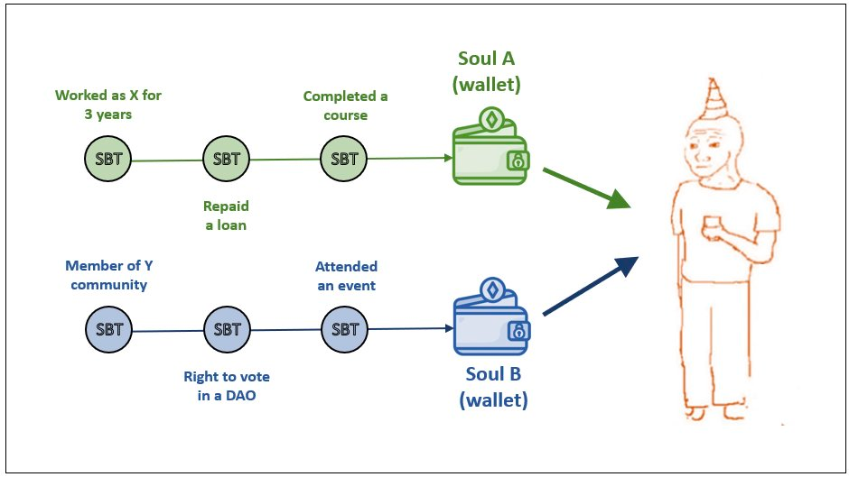

A basic understanding of [Non-Fungible Tokens (NFTs)](https://decrypt.co/resources/non-fungible-tokens-nfts-explained-guide-learn-blockchain "Non-Fungible Tokens (NFTs)")  will help you grasp the concepts of this article better.

### TL;DR

Soulbound Tokens (SBTs) are non-transferrable NFTs that shows-off your reputation. You receive SBTs for completing a degree, earning professional certification, working for a company, repaying a loan, winning an award, and so on. SBTs will help you to unlock opportunities.

Let us dive a little deep.

Soulbound Tokens (SBTs) are a new type of blockchain-enabled tokens to represent the commitments, credentials, and affiliations of SBT holders.

SBTs will be issued to Souls accounts (or wallets). In practice, you will have multiple Soul accounts. For example, you might have a Soul account to hold SBTs representing your college degrees, and employment history, and another Soul account that holds SBTs representing your community membership, voting rights in a DAO, and attendance at events.

### How are SBTs different from NFTs?

Both SBTs and NFTs are blockchain-enabled tokens. But there is a big difference between NFTs and SBTs. While NFTs are transferrable and can be bought and sold. SBTs are non-transferable that can't be bought, sold, or traded.

### Soulbound Tokens(SBTs) Use Cases

Here are a few examples of SBTs use in real life.

1. **Employment Verification:** Say Alex works at Google. Alex is trying to leave Google and join a new company, where Bob is the hiring manager. Bob wants to verify if Alex works at Google. In the current system, Alex has to provide the contact details of his manager at Google to Bob. Bob can directly call Alex's manager or engage a 3rd party service to verify his employment at Google. In the new system, Alex will be issued a non-transferrable SBT by Google that certifies that Alex is working at Google. Bob can verify Alex's employment at Google directly in the blockchain without contacting anyone. Employment verification based on SBTs will be much faster and more efficient than the current system.
2. **Collateral Free Loans:** Say Jim holds a portfolio of SBTs that represents his credentials, commitments, and affiliations that acts similar to credit history. Jim needs a personal loan to cover an emergency expense. SBTs held by Jim can prove a track record of his financial behavior to get his loan much faster, with minimal procedural obstacles. SBTs will help their holders acquire non-collateralized loans sooner. SBTs also help credit issuers verify borrowers' credit profiles faster than traditional modes of KYC that require extensive documentation and vetting.
3. **Property Rights:** Say Mary owns an apartment in Miami, FL. She holds an ownership NFT that allows her to rent, sell or transfer her apartment. Mary wants to rent her apartment to Mike. Mary can issue an SBT to Mike for leasing her apartment, but Mike can't sell or sublease the apartment as SBTs are non-transferable.

There are many other real-life use cases for SBTs. SBTs can be proof of attendance and participation in events. SBTs can be used to allow and verify community and DAO voting. SBTs can be used to detect bots and prevent fraud.

### Implementation Challenges

While SBTs enable an array of real-life use cases, a couple of implementation challenges require more experimentation and research.

- With wallets, there is a potential risk of losing the keys or theft. Community recovery solution recommended to recover lost or stolen SBTs. But coordinating a group of members who can come together to identify and attest to the lost souls or SBTs is an area that needs more experimentation.
- SBTs can be held private or public in soul accounts based on their use. There is a strong need for privacy to make SBTs work well. Cryptographic privacy solutions such as Zero Knowledge Proofs (ZKP) are becoming an industry standard for privacy. Research and developments are happening rapidly in Zero Knowledge Proofs (ZKP) to build privacy into Web3/Crypto ecosystem. Zero-knowledge proofs can make SBTs more private and secure.

**Conclusion:**

Web3 lacks primitives to represent humans and their relationships through social identity and still depends on web2 infrastructures replicating their limitations. Because of the permissionless nature of blockchains, anyone can create any number of accounts that are anonymous by default.

SBTs will play a big role in representing the identity and reputation needed for Web3 Social infrastructure. SBTs will help their holders better verify trust in each other unlocking new opportunities in a permissionless decentralized society.